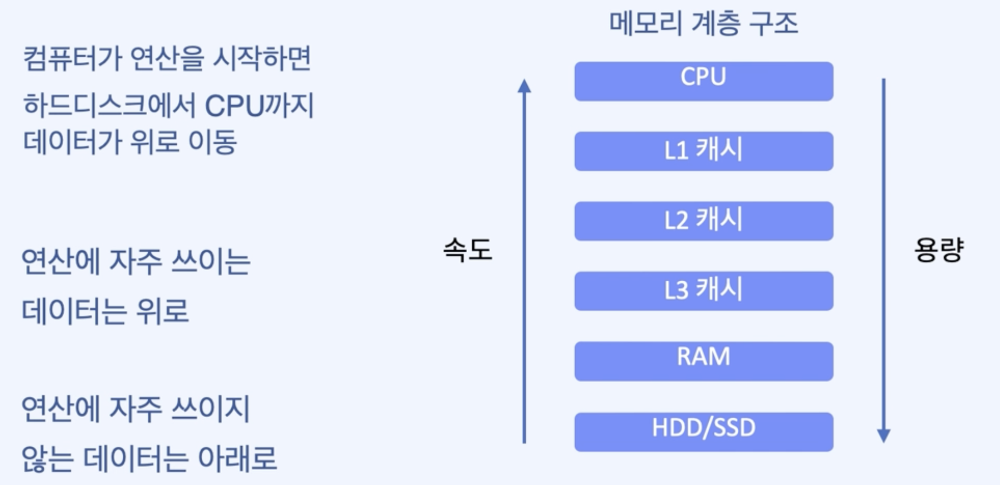

# Spark

- Data
    - **[High Volume For-Hire Vehicle Trip Records](https://nyc-tlc.s3.amazonaws.com/trip+data/fhvhv_tripdata_2020-03.csv)** (CSV)
	- **[ml-25m](https://grouplens.org/datasets/movielens/25m/)**
	- **[TLC Trip Record Data / 2021-01~2021-07 Yellow Taxi Trip Records](https://www1.nyc.gov/site/tlc/about/tlc-trip-record-data.page)**
- Spark 정리
    - 빅데이터 처리를 위한 오픈소스 고속 분산처리 엔진
    - 빅데이터 문제
        - 규모 : 데이터의 크기가 증가
        - 속도 : 데이터가 생성되는 속도 증가
        - 다양성 : 데이터의 종류가 증가
    - 메모리 계층 구조
        
        
        
    - Spark Cluster
        
        
        
    
    [Pandas vs Spark](folder/Pandas_vs_Spark.md)
    
    [Resilient Distibuted Dataset (RDD)](folder/Resilient_Distibuted_Dataset(RDD).md)
    
    [History](folder/History.md)
    
    [Cache & Persist](folder/Cache&Persist.md)
    
    [Cluster Topology](folder/Cluster_Topology.md)
    
    [Reduction Operations](folder/Reduction_Operations.md)
    
    [Structured vs Unstructured](folder/Structured_vs_Unstructured.md)
    
    [Spark SQL](folder/SparkSQL.md)
    
    [DataFrame](folder/DataFrame.md)
    
    [Catalyst Optimizer 및 Tungsten Project 작동원리](folder/Catalyst_Optimizer.md)
    
    [MLlib : Machine Learning Library](folder/MLlib_Machine_Learning_Library.md)
    
    [Spark Streaming](folder/Spark_Streaming.md)

	[실습 코드](code/)