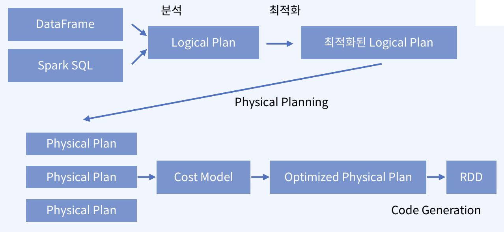

# Catalyst Optimizer 및 Tungsten Project 작동원리

- Spark Backend - 스파크는 쿼리를 돌리기 위해 두가지 엔진을 사용
    - Catalyst
        - SQL과 DataFrame이 구조가 있는 데이터를 다룰 수 있게 해주는 모듈
        - 하는 일 : Logical Plan → Physical Plan 으로 바꾸는 일
            1. 분석: DataFrame 객체의 relation을 계산, 칼럼의 타입과 이름 확인
            2. Logical Plan 최적화
                1. 상수로 표현된 표현식을  Compile time에 계산(runtime 계산 x)
                2. Predicate Pushdown join : join & filter → filter & join
                3. Projection Pruning : 연산에 필요한 칼럼만 가져오기
            3. Physical Plan 만들기 : Spark에서 실행 가능한 Plan으로 변환
            4. 코드 제너레이션 : 최적화된 Physical Plan을 Java Bytecode로
            
            > Logical Plan
            > 
            > - 수행해야 하는 모든 transformation 단계에 대한 추상화
            > - 데이터가 어떻게 변해야 하는지 정의하지만
            > - 실제 어디서 어떻게 동작하는지는 정의하지 않음
            
            > Physical Plan
            > 
            > - Logical Plan이 어떻게 클러스터 위에서 실행될지 정의
            > - 실행 전략을 만들고 Cost Model에 따라 최적화
        - Catalyst Pipeline
            
            
            
        - Explain - Execution Plan 확인
            - spark.sql(query).explain(True)
                - Parsed Logical Plan
                - Analyzed Logical Plan
                - Optimized Logical Plan
                - Physical Plan
    - Tungsten
        - Physical Plan이 선택되고 나면 분산 환경에서 실행될 Bytecode가 만들어지게 된다 - 이 프로세스를 Code Generation이라고 부른다
        - 스파크 엔진의 성능 향상이 목적
            - **메모리 관리 최적화**
            - **캐시 활용 연산**
            - **코드 생성**