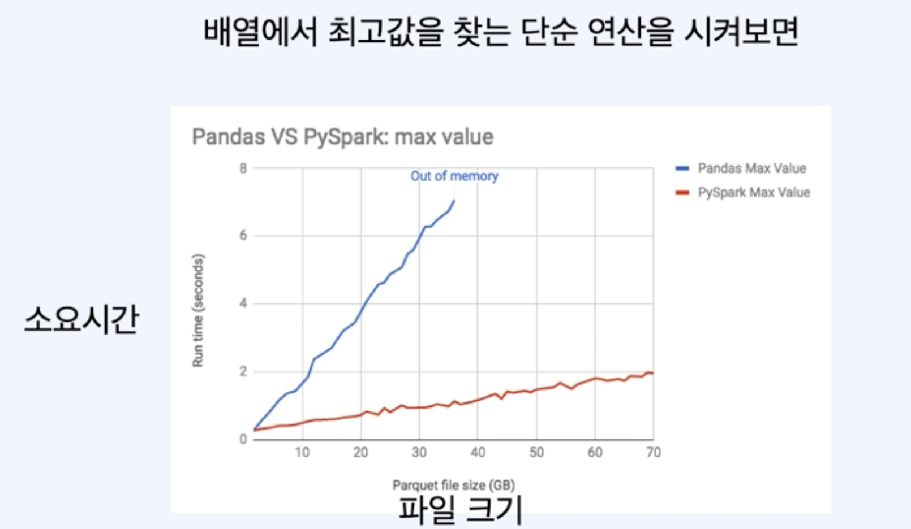

# Pandas vs Spark

| Pandas | Spark |
| --- | --- |
| 1개의 노드 | 여러 개의 노드 |
| Eager Execution - 코드가 바로바로 실행 | Lagy Execution - 실행이 필요할 때까지 기다림 |
| 컴퓨터 하드웨어에 제한을 받음 | 수평적 확장이 가능 |
| In-Memory 연산 | In-Memory 연산 |
| Mutable Data(변경 가능한 데이터) | Immutable Data(불변의 데이터) |