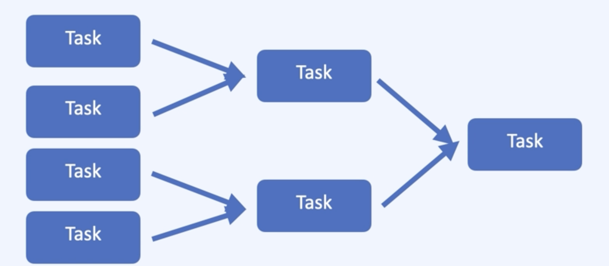

# Reduction Operations

- Reduction
    - 요소들을 모아서 하나로 합치는 작업
    - 많은 Spark의 연산들이 reduction
    - 대부분의 Action은 Reduction
    - 파일 저장, collect() 등과 같이 Reduction이 아닌 액션들도 있다.
- 병렬 처리가 가능한 경우
    
    
    
- 병렬 처리가 힘든 경우
    
    
    
    Network Cost가 늘어남
    

대표적인 Reduction Actions

- Reduce
    - RDD.reduce(<function>)
        
        ```python
        from operator import add
        sc.parallelize([1,2,3,4,5]).reduce(add) # 15
        
        # 파티션에 따라 결과 값이 달라지게 된다.
        sc.parallelize([1,2,3,4]).reduce(lambda x,y:(x*2)+y) # 26
        sc.parallelize([1,2,3,4],1).reduce(lambda x,y:(x*2)+y) # 26
        # (1,2,3,4) -> ((1*2+2)*2+3)*2+4 = 26
        sc.parallelize([1,2,3,4],2).reduce(lambda x,y:(x*2)+y) # 파티션 2개 지정 18 
        # (1,2)(3,4) -> ((1*2+2)*2+(3*2)+4) = 18
        sc.parallelize([1,2,3,4],3).reduce(lambda x,y:(x*2)+y) # 18
        sc.parallelize([1,2,3,4],4).reduce(lambda x,y:(x*2)+y) # 26
        ```
        
        - 파티션이 어떻게 나뉠지 정확하게 알기 어렵다
            - 연산의 순서와 상관 없이 결과값을 보장하려면
                - 교환법칙 a*b=b*a
                - 결합법칙 (a*b)*c=a*(b*c)
- Fold
    - RDD.fold(zeroValue,<function>)
        
        ```python
        #zeroValue 각 파티션에서 시작값
        from operator import add
        sc.parallelize([1,2,3,4,5]).fold(0,add) # 15
        
        rdd = sc.parallelize([2,3,4],4)
        rdd.reduce(lambda x,y:x*y) # 24
        # (2*3*4) = 24
        rdd.fold(1,lambda x,y:x+y) # 24
        # (1*2*3*4) = 24
        rdd.reduce(lambda x,y:x*y) # 24
        # 0+2+3+4 = 9
        rdd.fold(1,lambda x,y:x*y) # 24 / 각 파티션의 시작값이 1 
        # (1+1)+(1+2)+(1+3)+(1+4) = 14
        rdd.fold(0,lambda x,y:x*y) # 0
        ```
        
- GroupBy
    - RDD.groupBy(<기준 함수>)
        
        ```python
        rdd = sc.parallelize([1,1,2,3,5,8])
        result = rdd.groupBy(lambda x:x%2).collect()
        sorted([(x,sorted(y)) for (x,y) in result])
        #((0,[2,8]),(1,[1,3,5]))
        ```
        
- Aggregate
    - RDD 데이터 타입과 Action 결과 타입이 다를 경우 사용
    - 파티션 단위의 연산 결과를 합치는 과정을 거친다.
    - RDD.Aggregate(zeroValue,seqOp,combOp)
        - zeroValue : 각 파티션에서 누적할 시작 값
        - seqOp : 타입 변경 함수
        - combOp : 합치는 함수
        
        ```python
        seqOp = (lambda x,y: (x[0] + y, x[1]+1))
        combOp = (lambda x,y: (x[0] + y[0], x[1]+y[1]))
        sc.parallelize([1,2,3,4]).aggregate((0,0),seqOp,combOp)
        #(10,4)
        sc.parallelize([]).aggregate((0,0),seqOp,combOp)
        #(0,0)
        ```