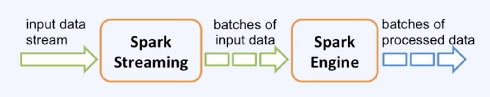

# Spark Streaming

- Spark Streaming
    - SQL 엔진 위에 만들어진 분산 스트림 처리 프로세싱
    - 데이터 스트림을 처리할 때 사용
    - 시간대 별로 데이터를 합쳐 분석할 수 있음
    - kafka,Amazon kinesis,HDFS 등과 연결 가능
    - 체크 포인트를 만들어서 부분적인 결함이 발생해도 다시 돌아가서 데이터를 처리할 수 있다.(fault-tolerant)
- Streaming Data
    - Streaming Data는 무한한 테이블이다.
    - 잘게 쪼개서 사용
        
        
        
- Discretized Streams(DStreams)
    - Spark Stream의 기본적인 추상화
        - 내부적으로 RDD의 연속이고 RDD의 속성을 이어받음
            
            
            
- Window Operations
    - 지금의 데이터를 처리하기 위해 이전 데이터에 대한 정보가 필요할 때
        
        
        
- Streaming Query
    - 데이터를 어디서 읽어올지 명시
    - 여러 데이터 소스를 사용해 join()이나 union()으로 합쳐 쓸 수 있다.
    - 예제 소스
        
        ```python
        spark.readStream.format("kafka")\
        	.option("kafka.bootstrap.servers",...)\
        	.option("subscribe","topic")\
        	.load()\
        	.selectExpr("cast(value as string) as json")\
        	.select(from_json("json",schema).As("data"))\
        	.writeStream.format("parquet")\
        	.trigger("1 minute") # micro-batch 실행 간격
        	.option("checkpointLocation"."...")\
        	.start()
        ```
        
- State 관리
    - 이전 데이터에 대한 정보를 State로 주고 받을 수 있다.
    - 예) 카테고리별(키값 별) 총합